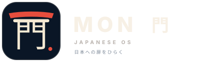
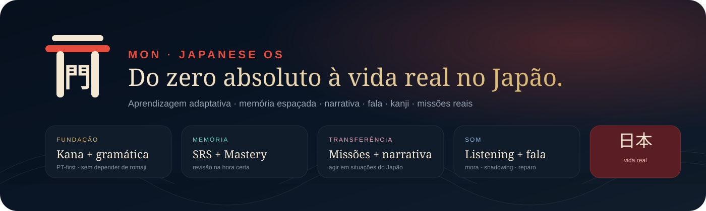
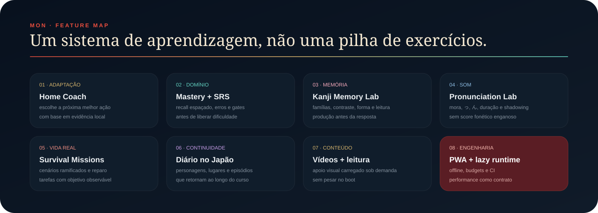

<p align="center">
  
</p>

<p align="center">
  <strong>Aprenda japonês do zero à vida real.</strong><br>
  Uma PWA de aprendizagem adaptativa pensada para quem fala português/inglês e precisa construir autonomia no Japão.
</p>

<p align="center">
  
</p>

# MON 門 Japanese OS

O **MON** é uma aplicação web/PWA para aprender japonês desde o zero absoluto até situações reais do cotidiano. **Release atual: 0.1.1 (pre-1.0).** Em vez de organizar o estudo apenas como listas de palavras ou exercícios repetidos, o produto combina **Fundação Zero, SRS, Mastery Graph, leitura adaptativa com romaji/furigana, narrativa recorrente, prática adaptativa, Kanji Memory Lab, listening, fala, missões de sobrevivência e validação longitudinal da aprendizagem**.

O sistema adapta a próxima sessão usando evidências reais do aluno, acompanha retenção e transferência ao longo do tempo e preserva uma arquitetura local-first, offline e orientada a performance. O motor de sincronização multi-device já está implementado com revisão otimista e conflitos explícitos; a ativação cloud depende da configuração do Supabase no ambiente publicado.

A interface segue uma identidade japonesa contemporânea: sumi/indigo, shu vermilion, washi, dourado, tipografia editorial, torii, sakura e padrões culturais tratados de forma discreta.

<p align="center">
  
</p>

## O que já existe

| Área | O que faz |
| --- | --- |
| **Fundação Zero** | Som, hiragana, katakana, gramática inicial e retirada progressiva do suporte de leitura |
| **Home Coach** | Escolhe uma próxima ação principal usando sinais reais do aluno |
| **Next Best Lesson Engine** | Monta a próxima sessão a partir de revisão, erros, domínio, narrativa e, quando há evidência suficiente, sinais longitudinais |
| **Daily Loop adaptativo** | Alterna ouvir, recuperar, aprender, aplicar, transferir e produzir |
| **SRS + Caderno de Erros** | Agenda memória e reapresenta padrões que continuam falhando |
| **Mastery Graph** | Separa evidência de reconhecimento, recall, listening, transferência e produção e alimenta decisões adaptativas |
| **Learning Validation** | Mede retenção 1d+/3d+/7d+, dependência de pistas, transferência, autonomia e recuperação de erros sem inferir causalidade |
| **P9/P10 Pedagogy Gate** | Exige que as 36 unidades N4 preservem Study Blocks, compreensão conceitual, capabilities, retrieval, transfer, production, repair e provenance |
| **Adaptive Reading Support** | Usa romaji, furigana ou nenhum apoio conforme a fase e a evidência de autonomia de leitura; erros podem fazer o suporte reaparecer |
| **Kanji Memory Lab 2.0** | Famílias visuais, contraste, sentido → forma, forma → leitura e escrita |
| **Listening & Pronunciation Lab** | Mora, vogais longas, っ, ん, shadowing e autoavaliação |
| **Survival Missions 2.0** | Cenários ramificados com reparo de conversa e objetivo observável |
| **Diário no Japão** | Registra personagens, lugares, callbacks e situações resolvidas |
| **Conta & Sync** | Estado versionado, revisão otimista, dirty tracking e resolução explícita de conflitos entre dispositivos |
| **Vídeos** | Biblioteca de apoio visual lazy, com player externo somente no clique |
| **PWA/offline** | Shell e features cacheados para uso resiliente |
| **Performance Lab** | Diagnóstico local com p50/p95, long tasks, cache e tempo até lição interativa via `?debug=1` |

## Princípios pedagógicos

- **recuperar antes de rever**;
- retirar romaji e furigana conforme a autonomia aparece, mas permitir que o apoio retorne quando a evidência enfraquece;
- avançar por **domínio demonstrado**, não apenas por conclusão;
- intercalar reconhecimento, listening, recall, transferência e produção;
- ensinar gramática com modelos mentais em português, evitando equivalências literais enganosas;
- reutilizar conteúdo em personagens, lugares e situações recorrentes;
- calibrar adaptação apenas quando existe evidência suficiente, sem deixar amostras pequenas comandarem a sessão;
- tratar reconhecimento de voz como **pista textual**, não como avaliação fonética clínica;
- usar vídeo como apoio, nunca como substituto de prática ativa;
- distinguir tendência observada de causalidade comprovada.

## Arquitetura

O projeto usa uma arquitetura progressivamente modular e lazy:

```text
index.html
├── shell crítico
├── data/                 conteúdo
├── core/                 estado + motores pedagógicos
├── features/             superfícies carregadas sob demanda
├── config/               configuração pública opcional
├── supabase/             schema da camada cloud
├── assets/               marca, cenas e banners
├── scripts/              contratos e budgets
└── .github/workflows/    Quality Gate
```

Algumas fronteiras importantes:

- `core/home-coach.js` — próxima melhor ação da Home;
- `core/next-best-lesson.js` — receita adaptativa e calibração conservadora da próxima sessão;
- `core/review-scheduler.js` — revisão espaçada;
- `core/mastery-graph.js` — evidência de domínio e autonomia de leitura;
- `core/reading-support.js` — romaji/furigana adaptativos com fallback conservador;
- `data/narrative.js` + `core/narrative-state.js` — memória narrativa;
- `features/pronunciation.js` — Listening & Pronunciation Lab;
- `features/kanji-memory.js` — Kanji Memory Lab 2.0;
- `features/missions-v2.js` — Survival Missions 2.0.

## Adaptação por evidência

O Next Best Lesson prioriza dívidas pedagógicas diretas antes de qualquer calibração longitudinal: remediation, revisões vencidas, gaps funcionais, erros abertos, fragilidade de domínio e narrativa pendente continuam tendo precedência.

A ajuda de leitura também segue uma política conservadora. Enquanto existem poucas observações, o MON usa a fase da Fundação como fallback. Depois de evidência suficiente em leituras sem pista, a progressão passa a responder ao Mastery Graph: **romaji → furigana → sem apoio**. Se erros recorrentes derrubarem a evidência de autonomia, o suporte pode reaparecer automaticamente.

Sinais longitudinais só interferem quando existe amostra suficiente. Retenção 7d+ e transferência observada podem frear um avanço e puxar a sessão para `retrieve` ou `transfer`; outras métricas continuam observacionais quando ainda não existe base suficiente para transformá-las em política adaptativa.

A camada de validação longitudinal acompanha retenção após 1d+, 3d+ e 7d+, tendências de hints, transferência, autonomia e recuperação de erros recorrentes. Esses sinais descrevem o estado observado do aluno e **não são tratados como prova causal da eficácia de uma feature**.

## Estado local, conta e sincronização

O MON continua local-first. O progresso versionado funciona sem conta e possui recovery, backup e migrations.

A camada multi-device adiciona revisão otimista, compare-and-set, conflito explícito quando local e nuvem mudam, escolha entre usar este dispositivo ou usar a nuvem, backup local antes de substituição e Row Level Security por usuário.

O cliente de sync está implementado. Para ativá-lo em um ambiente publicado, é necessário aplicar `supabase/schema.sql` e configurar a URL pública e a publishable key em `config/cloud.js`. Credenciais privilegiadas não pertencem ao browser nem ao repositório.

## Performance

A regra arquitetural é simples: **uma nova feature não deve automaticamente virar custo de boot**.

O projeto possui budgets separados para shell, datasets e features lazy. O Quality Gate falha se uma fronteira ultrapassar os limites definidos em `scripts/test-performance-budget.mjs`.

O `Performance Lab` pode ser ativado localmente com:

```text
?debug=1
```

Ele mostra distribuições p50/p95, mínimo, máximo, long tasks, recursos mais lentos, estado de cache e tempo até a lição ficar interativa, sem telemetria externa.

O CI também executa baseline e calibração multi-run em Chromium, Firefox e WebKit. Milissegundos absolutos ainda não viram gate de latência enquanto não existir baseline representativo em dispositivos reais.

## Rodar localmente

```bash
python -m http.server 8080
```

Abra:

```text
http://localhost:8080
```

## Qualidade e segurança

O workflow `.github/workflows/quality.yml` verifica, entre outros:

- sintaxe JavaScript e contratos estáticos;
- acessibilidade, foco, reduced motion e política de microfone;
- sistema tipográfico;
- curriculum/content quality;
- review scheduler;
- Gate Loop;
- adaptive teaching;
- Mastery Graph, Reading Mastery e Learning Evidence;
- validação longitudinal da aprendizagem;
- narrativa e persistência;
- Home Coach;
- Next Best Lesson Engine;
- Daily Loop;
- Pronunciation Lab;
- Kanji Memory Lab;
- Adaptive Reading Support;
- Survival Missions;
- lazy loading;
- budgets de performance;
- PWA/cache;
- boundary de conta, RLS e sincronização multi-device;
- baseline e calibração de latência;
- smoke responsivo e cross-browser em Chromium, Firefox e WebKit;
- integridade e segurança do repositório.

## Roadmap

O roadmap operacional fica em [`docs/ROADMAP.md`](docs/ROADMAP.md).

A ordem é por **dependência, risco e ganho de aprendizagem**, não por volume de funcionalidades. O **gate estrutural N5 está concluído**, o **N4 já possui contrato por capacidades**, a validação longitudinal e a calibração conservadora do NBL estão implementadas, e a camada multi-device já possui motor de conflitos explícitos.

O foco atual é continuar validando retenção, transferência e autonomia de leitura ao longo do tempo, calibrar gates funcionais com evidência real, ampliar a cobertura do suporte adaptativo sem criar dependência de pistas, avançar o refinamento P8 nas superfícies publicadas e transformar latência absoluta em gate somente quando houver baseline representativo fora do laboratório de CI.

## Marca

O símbolo combina o kanji `門` (*mon*, “portão”) com um lintel inspirado em torii.

Masters vetoriais:

- `assets/brand/mon-lockup.svg`
- `assets/brand/mon-mark.svg`
- `assets/brand/mon-mark-reversed.svg`
- `assets/brand/mon-mark-mono.svg`

Paleta principal:

- Sumi / Indigo `#0A1626`
- Shu Vermilion `#E64D3D`
- Washi Ivory `#F4E8D2`
- Kin Gold `#D7B56D`
- Jade `#63D3C2`

## Documentação

- [Roadmap](docs/ROADMAP.md)
- [Japanese Learning System](docs/JAPANESE-LEARNING-SYSTEM.md)
- [N5 Readiness Gate](docs/N5-READINESS.md)
- [N4 Capability Contract](docs/N4-CAPABILITIES.md)
- [P9/P10 Pedagogical Validation](docs/PEDAGOGICAL-VALIDATION.md)
- [Learning Metrics](docs/LEARNING-METRICS.md)
- [Learning Validation](docs/LEARNING-VALIDATION.md)
- [Next Best Lesson Calibration](docs/NBL-CALIBRATION.md)
- [State Recovery & Backup](docs/STATE-RECOVERY.md)
- [Multi-device Sync](docs/MULTI-DEVICE-SYNC.md)
- [PWA Runtime Resilience](docs/PWA-RUNTIME.md)
- [Production Release Contract](docs/PRODUCTION-RELEASE.md)
- [Incident Response & Runtime Health](docs/INCIDENT-RESPONSE.md)
- [Accessibility & Microphone Policy](docs/ACCESSIBILITY-MICROPHONE.md)
- [Typography System](docs/TYPOGRAPHY.md)
- [Latency Observability](docs/LATENCY-OBSERVABILITY.md)
- [Pesquisa de Quality Engineering](docs/QUALITY-RESEARCH-2026-10-03.md)
- [Segurança](SECURITY.md)
- [Contribuição](CONTRIBUTING.md)
- [Licença e dependências](docs/LICENSE-STATUS.md)

---

<p align="center">
  <strong>門を開く。Abra o portão.</strong><br>
  Japonês como sistema de autonomia, não apenas como coleção de lições.
</p>